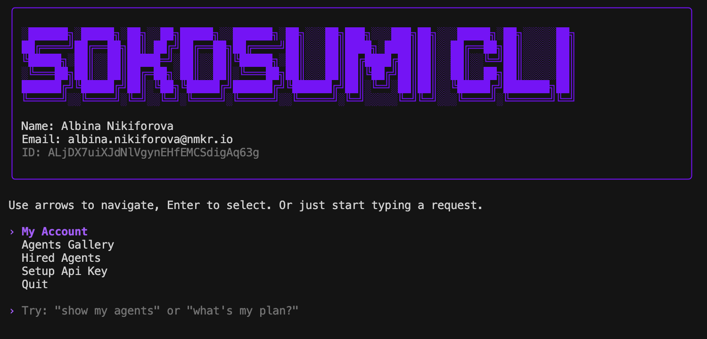

# Sokosumi CLI


Ink + React CLI styled like modern AI CLIs (Claude/Codex/Gemini). Animated intro logo, first-run API key setup, and a natural language prompt with a navigable menu.

## Screenshot



## Requirements
- Node.js >= 18
- Yarn 1 (v1.22+). The project declares `packageManager: yarn@1.22.22` and a `prepare` script to enable Corepack.

## Install
```bash
# from project root
corepack enable  # optional; Yarn will be available via Corepack
yarn install
```

## Run
```bash
yarn start
```
- On first run, you will be prompted for your My Sokosumi API Key.
- The key is saved to `.env` as `SOKOSUMI_API_KEY`.

## CLI Features
- Animated intro using `logo_sokosumi_pixelart.txt` (line-by-line loading)
- Brand color for menu/titles: `#7F00FF` (RGB 127,0,255)
- First-run setup flow to capture API key and save locally
- Main menu:
  - My Account
  - Agents
  - Jobs
  - Quit
- Natural language prompt: type a request like "show my agents" and press Enter.
- Keyboard:
  - Arrow Up/Down: navigate menu
  - Enter: select/submit
  - Esc: go back from sub-screens to main menu

## Configuration
- `.env` file in project root with:
```
ANTHROPIC_API_KEY=your-key-here
SOKOSUMI_API_KEY=your-key-here
SOKOSUMI_API_URL=https://app.sokosumi.com
```
- `.env.example` template file that you can use.

## Scripts
- `yarn start` - run the CLI
- `yarn prepare` - enables Corepack on install

## Roadmap
- Wire up real APIs/schemas for Account, Agents, Jobs
- Persist additional user settings
- Improve input masking for API key entry

## License
Add your license of choice. Currently no license is declared.

