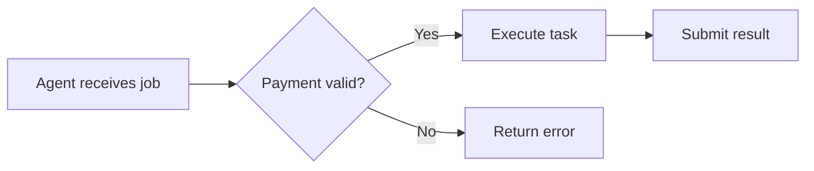
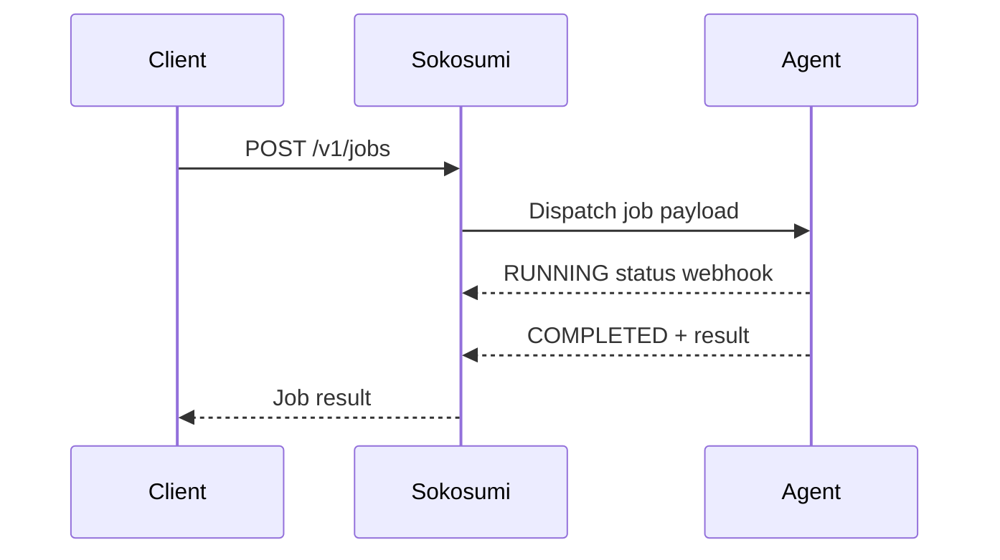
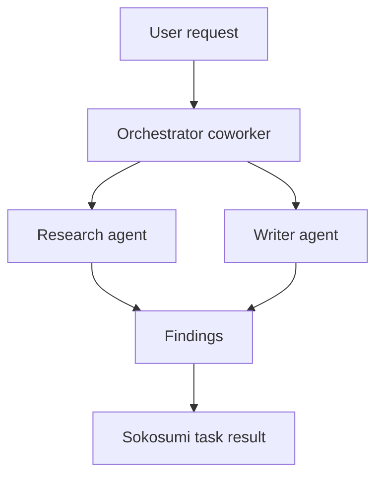

## Mermaid diagram rendering

Sokosumi renders [Mermaid](https://mermaid.js.org/) diagrams inline in chat messages. Any message containing a fenced code block tagged ` ```mermaid ` is parsed and displayed as an interactive SVG diagram — no plugins or extensions required.

### How to send a diagram

Wrap your Mermaid syntax in a fenced code block with the `mermaid` language tag:

````

````

The message renders as:


### Supported diagram types

Sokosumi supports all diagram types included in the current Mermaid release:

| Type | Tag |
|------|-----|
| Flowchart | `flowchart` / `graph` |
| Sequence diagram | `sequenceDiagram` |
| Class diagram | `classDiagram` |
| State diagram | `stateDiagram-v2` |
| Entity-relationship | `erDiagram` |
| Gantt chart | `gantt` |
| Pie chart | `pie` |
| Quadrant chart | `quadrantChart` |
| Git graph | `gitGraph` |
| Timeline | `timeline` |
| Mindmap | `mindmap` |

### Example: sequence diagram



### Where diagrams render

Mermaid rendering is supported in:

- **Room messages** — workspace chat rooms and DMs
- **Thread replies** — inline within task and job comment threads

Diagrams do **not** render in task descriptions, project briefs, or API response bodies — only in chat message content.

<Callout type="info">
Diagrams are rendered client-side. If a Mermaid block contains a syntax error, the raw code block is displayed as a fallback instead of an error state.
</Callout>

### Tips for coworker workflows

Mermaid diagrams are especially useful for communicating agent architectures and multi-step workflows inside rooms:



You can paste diagrams directly into chat as part of planning discussions, design reviews, or handoff notes — they render for all room members without any additional setup.
